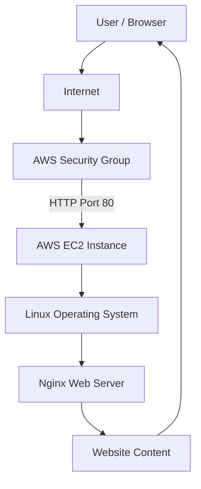

# AWS EC2 Nginx Web Server Architecture

```mermaid
flowchart TD
    A[User / Browser] --> B[Internet]
    B --> C[AWS Security Group]
    C -->|HTTP Port 80| D[AWS EC2 Instance]
    D --> E[Linux Operating System]
    E --> F[Nginx Web Server]
    F --> G[Website Content]
    G --> A
```